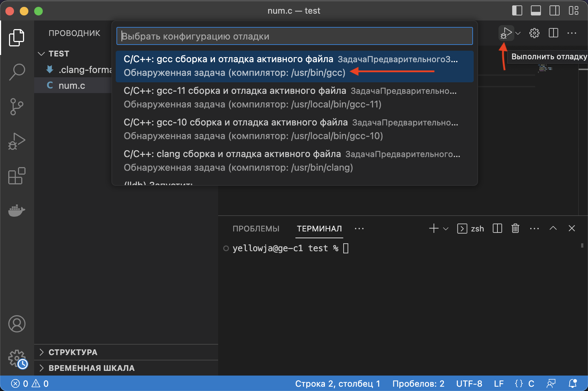
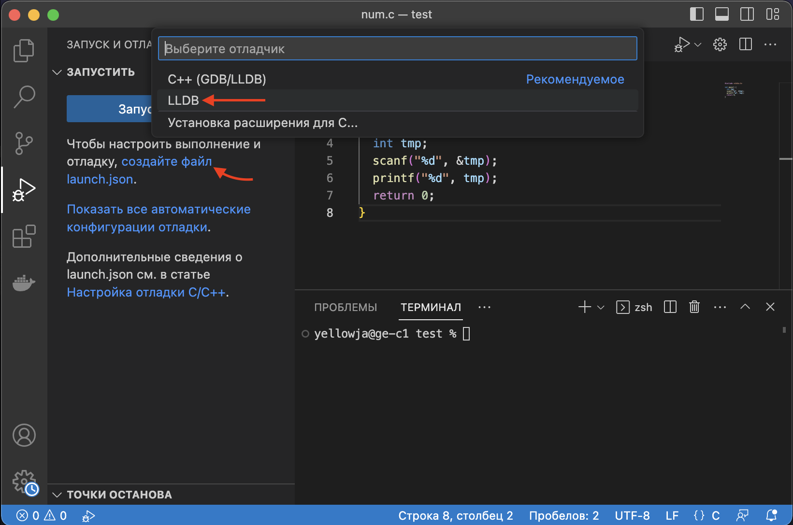
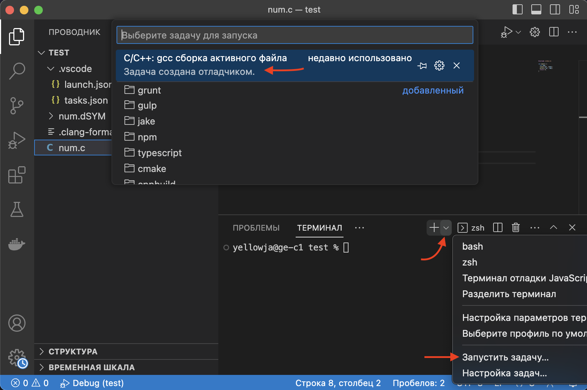
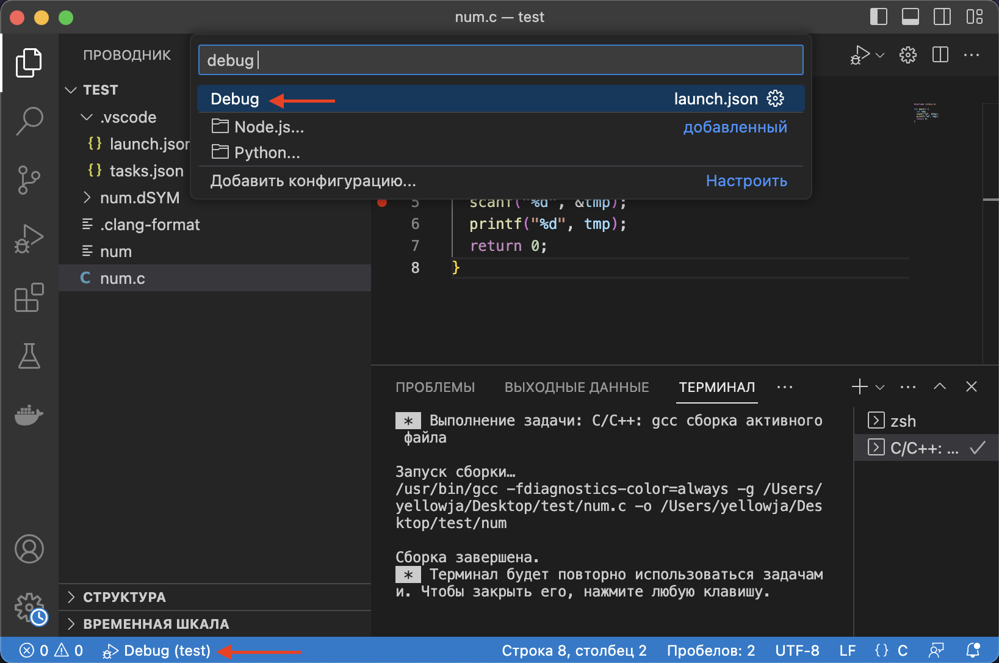

# Запуск дебаггера в vscode
0. Установите в VSCode расширение [CodeLLDB](https://marketplace.visualstudio.com/items?itemName=vadimcn.vscode-lldb)
1. Запустите свой файл через отладку vscode. Первый раз нужно ввести пароль от аккаунта

2. Сразу останавливаем отладку. В папке должен создаться файл `.vscode/tasks.json`. Из этого файла скопируйте `${fileDirname}/${fileBasenameNoExtension}`

3. Переходим во вкладку отладки и создаем файл `launch.json`, выбрав LLDB. В этом файле в строке `program` заменить `${workspaceFolder}/<executable file>` на скопированное значение

4. Через меню терминала запустить задачу и выбрать компилятор gcc. Это запустит компиляцию открытого .c файла. Так же можно запустить задачу сочетанием клавиш ⇧⌘B

5. Откройте файл .с (это важно, он должен быть открыт), поставьте точку остановки и запустите отладку через нижнее контекстное меню или во вкладке отладки. Так же можно запустить отладку клавишей `F5`.

6. Правим программу и повторяем шаги 4 и 5

ps. Дебагер выводит текст построчно! работает только `printf("строка\n");`. Без переноса строки (`\n`) строку не выводит.